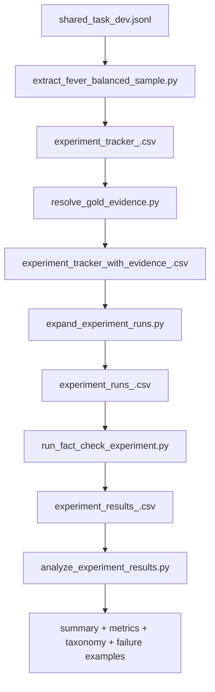

# FEVER Evidence-Aware Fact-Checking Experiment

## Project Overview
This repository contains a script-based research pipeline that evaluates whether providing gold evidence improves LLM fact-checking performance on FEVER claims.

The current default experiment setup is:
- Dataset tag: `balanced_10000_v1`
- Labels: `Supported` and `Refuted` only (no `NOT ENOUGH INFO`)
- Size: 10000 claims total (5000 per label)
- Conditions: `claim_only`, `claim_plus_evidence`
- Models: `gpt-5.4`, `gpt-5.4-mini`

Completed benchmark results currently committed in this repo are from the smaller `balanced_1000_v1` run.

## Research Question
How much does model accuracy improve when the model is given resolved gold evidence instead of only the claim text?

## What The Pipeline Produces
The pipeline generates all artifacts needed for analysis and reporting:
- Balanced sample datasets and provenance files
- Resolved evidence tracker (`gold_evidence` and evidence-set metadata)
- Expanded run matrix (`model x condition` per claim)
- Raw experiment outputs from OpenAI responses
- Summary tables, key metrics, and evidence-error analysis outputs

## How It Works
1. Build a balanced FEVER sample from `shared_task_dev.jsonl`.
2. Resolve FEVER evidence pointers to readable text using local wiki shards.
3. Validate dataset integrity (size, label balance, required fields).
4. Expand each claim into 4 runs (`2 models x 2 conditions`).
5. Run OpenAI inference and write incremental result rows.
6. Analyze outputs to compute accuracy, evidence gain, evidence failure rate, and error taxonomy counts.



## Quick Start

### 1) Install dependencies
```powershell
python -m pip install -r requirements-openai.txt
```

### 2) Set API key
Set `OPENAI_API_KEY` in your environment, or place it in a local `.env` file at repo root:

```text
OPENAI_API_KEY=your_key_here
```

### 3) Prepare FEVER wiki shards
```powershell
python prepare_fever_wiki_pages.py
```

### 4) Build balanced dataset
```powershell
python extract_fever_balanced_sample.py
```

### 5) Resolve gold evidence
```powershell
python resolve_gold_evidence.py
```

### 6) Validate and expand runs
```powershell
python expand_experiment_runs.py
```

### 7) (Optional) Create a pilot subset (50 claims)
```powershell
python create_pilot_runs_subset.py --input experiment_runs_balanced_10000_v1.csv --output experiment_runs_balanced_10000_v1_pilot.csv --pilot-claims 50
```

### 8) Run pilot and analyze
```powershell
python run_fact_check_experiment.py --input experiment_runs_balanced_10000_v1_pilot.csv --output experiment_results_balanced_10000_v1_pilot.csv
python analyze_experiment_results.py --input experiment_results_balanced_10000_v1_pilot.csv --output experiment_summary_balanced_10000_v1_pilot.csv --metrics-output experiment_metrics_balanced_10000_v1_pilot.csv
```

### 9) Run full experiment and analyze
```powershell
python run_fact_check_experiment.py
python analyze_experiment_results.py
```

### Scale-up Status (already prepared)
The 5k/5k dataset preparation has already been completed in this workspace:
- `fever_balanced_10000_v1_source.csv` (10000 rows)
- `experiment_tracker_balanced_10000_v1.csv` (10000 rows)
- `experiment_tracker_with_evidence_balanced_10000_v1.csv` (10000 rows, unresolved=0)
- `experiment_runs_balanced_10000_v1.csv` (40000 rows)
- `sample_validation_balanced_10000_v1.json`
- `dataset_validation_balanced_10000_v1.json` (`ready_for_expansion=true`)

So the next step is only model execution and analysis on `balanced_10000_v1`.

## Results (Committed Artifacts)

### Full Run: `balanced_1000_v1`
From `experiment_summary_balanced_1000_v1.csv` and `experiment_metrics_balanced_1000_v1.csv`:

| Model + Condition | Accuracy | Correct / Valid |
|---|---:|---:|
| gpt-5.4 + claim_only | 86.30% | 863 / 1000 |
| gpt-5.4 + claim_plus_evidence | 94.20% | 942 / 1000 |
| gpt-5.4-mini + claim_only | 83.20% | 832 / 1000 |
| gpt-5.4-mini + claim_plus_evidence | 93.40% | 934 / 1000 |

Condition-level aggregate:
- `claim_only`: 84.75% (1695 / 2000)
- `claim_plus_evidence`: 93.80% (1876 / 2000)
- Net gain from evidence: +9.05 percentage points

Evidence-specific metrics:
- `gpt-5.4`: evidence gain +7.90 pp, evidence failure rate 5.80%
- `gpt-5.4-mini`: evidence gain +10.20 pp, evidence failure rate 6.60%

Evidence-condition error taxonomy counts (`error_taxonomy_counts_balanced_1000_v1.csv`):
- `supported_to_refuted`: 75
- `refuted_to_supported`: 49

### Pilot Run: `balanced_1000_v1_pilot`
From `experiment_summary_balanced_1000_v1_pilot.csv` and `experiment_metrics_balanced_1000_v1_pilot.csv`:

| Model + Condition | Accuracy | Correct / Valid |
|---|---:|---:|
| gpt-5.4 + claim_only | 92.00% | 46 / 50 |
| gpt-5.4 + claim_plus_evidence | 94.00% | 47 / 50 |
| gpt-5.4-mini + claim_only | 78.00% | 39 / 50 |
| gpt-5.4-mini + claim_plus_evidence | 96.00% | 48 / 50 |

Condition-level aggregate:
- `claim_only`: 85.00% (85 / 100)
- `claim_plus_evidence`: 95.00% (95 / 100)
- Net gain from evidence: +10.00 percentage points

## Key Scripts
- `experiment_config.py`: shared constants for tags, labels, models, conditions, and FEVER wiki paths.
- `prepare_fever_wiki_pages.py`: downloads/extracts FEVER wiki shards into expected local structure.
- `extract_fever_balanced_sample.py`: samples balanced FEVER claims and writes source/tracker/provenance/validation outputs.
- `resolve_gold_evidence.py`: resolves shortest complete evidence set and writes prompt-ready `gold_evidence`.
- `expand_experiment_runs.py`: validates source data and expands rows to model-condition run matrix.
- `create_pilot_runs_subset.py`: builds a smaller pilot run file from expanded runs.
- `run_fact_check_experiment.py`: executes OpenAI calls and writes resumable results CSV.
- `analyze_experiment_results.py`: computes grouped summaries, metrics, and error-analysis outputs.

## Output Files You Will Use Most
- Default large-run paths (new target):
    - `experiment_runs_balanced_10000_v1.csv`
    - `experiment_results_balanced_10000_v1.csv`
    - `experiment_summary_balanced_10000_v1.csv`
    - `experiment_metrics_balanced_10000_v1.csv`
- Baseline benchmark paths (already completed):
    - `experiment_results_balanced_1000_v1.csv`
    - `experiment_summary_balanced_1000_v1.csv`
    - `experiment_metrics_balanced_1000_v1.csv`
    - `evidence_condition_errors_balanced_1000_v1.csv`
    - `error_taxonomy_counts_balanced_1000_v1.csv`
    - `example_failure_cases_balanced_1000_v1.csv`

## Notes and Limitations
- No automated unit/integration test suite is included yet.
- This is a script workflow (not a packaged CLI or web service).
- Reproducibility depends on stable API behavior and local FEVER wiki shard availability.
- If wiki shards are missing, evidence resolution and downstream expansion are intentionally blocked by validation.

## License
This project is licensed under the MIT License. See `LICENSE`.
